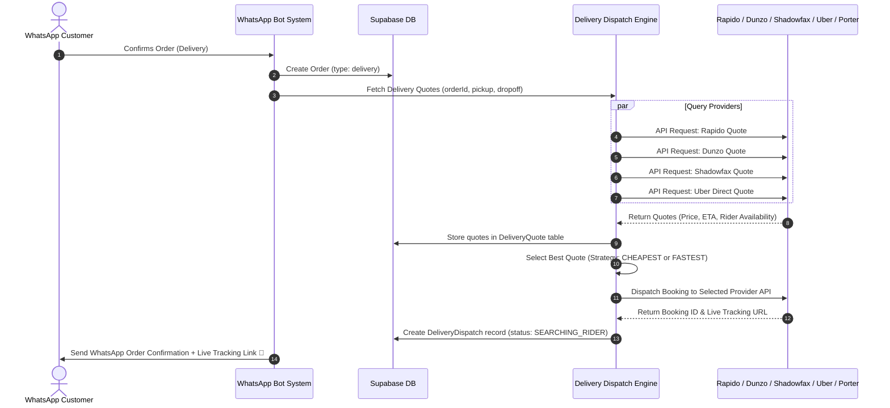

# 🚚 Multi-Provider Delivery Integration Guide

This document explains the architecture for integrating multi-provider third-party delivery dispatch (Rapido Parcel, Dunzo, Shadowfax, Uber Direct, Porter) into the **Godavari Ruchulu** WhatsApp bot system.

---

## 1. Overview & Business Workflow

---

## 2. Dynamic Selection Strategies

The `RestaurantConfig` table defines the `defaultDeliveryStrategy` used to evaluate competitive quotes:

| Strategy | Algorithm / Selection Logic | Best Use Case |
| :--- | :--- | :--- |
| **`CHEAPEST`** | Selects the provider offering the lowest `quotedFee` in ₹ among available providers. | Maximizing restaurant profit margin on standard deliveries. |
| **`FASTEST`** | Selects the provider offering the shortest `estimatedMinutes` (ETA). | Peak lunch/dinner rush when food freshness is top priority. |
| **`BALANCED`** | Computes score $S = \text{Fee} + (\text{ETA} \times 2)$. Selects lowest $S$. | Optimal trade-off between price and speed. |

---

## 3. Database Schema Models

### A. Provider Credentials (`DeliveryProviderConfig`)
Stores API tokens and merchant configuration per provider.

### B. Pre-Dispatch Quotes (`DeliveryQuote`)
Stores real-time quote responses from all enabled providers for side-by-side comparison before booking.

### C. Active Booking & Live Tracking (`DeliveryDispatch`)
Tracks booking state (`SEARCHING_RIDER` $\rightarrow$ `RIDER_ASSIGNED` $\rightarrow$ `PICKED_UP` $\rightarrow$ `IN_TRANSIT` $\rightarrow$ `DELIVERED`), rider contact information, live GPS coordinates (`riderLat`, `riderLng`), and customer tracking web URL.

---

## 4. Webhook Status Tracking

Each delivery provider emits webhooks to notify your server of status updates:

- **`POST /api/delivery/webhook/rapido`**
- **`POST /api/delivery/webhook/dunzo`**
- **`POST /api/delivery/webhook/shadowfax`**
- **`POST /api/delivery/webhook/uber`**

### Automated WhatsApp Alerts:
1. **Rider Assigned:** *"Your order is being picked up by {riderName} ({riderPhone})!"*
2. **Picked Up & Out for Delivery:** *"Your order is on the way! Track live: {trackingUrl}"*
3. **Delivered:** *"Order delivered! Enjoy your meal from Godavari Ruchulu."*
