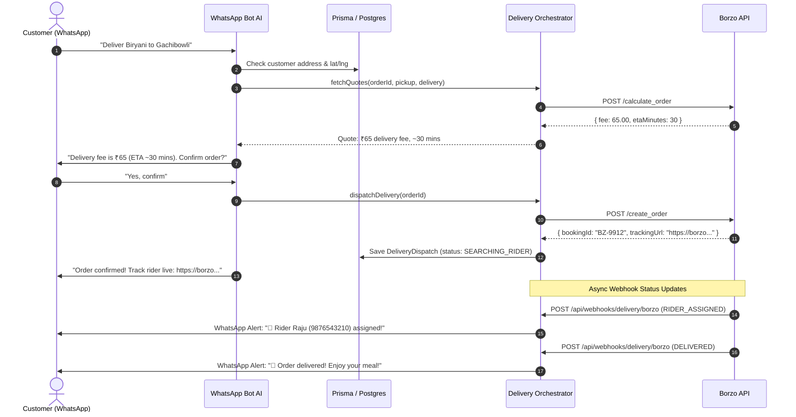

# 🚚 Hyperlocal Delivery Providers — Comprehensive Research & Integration Guide

> **Last Updated:** July 2026  
> **Target City:** Hyderabad, Telangana (Focus Areas: Gachibowli, Hitec City, Madhapur, Jubilee Hills, Banjara Hills, Kukatpally)  
> **Use Case:** Automated delivery dispatch from the Godavari Ruchulu WhatsApp ordering bot. Customer places order via WhatsApp → bot fetches quotes → dispatches rider → sends live tracking link to customer.

---

## Table of Contents

1. [Provider Comparison Matrix](#1-provider-comparison-matrix)
2. [Tier 1 — Immediately Integratable](#2-tier-1--immediately-integratable)
   - [Borzo (ex-WeFast)](#21-borzo-ex-wefast-)
   - [Shiprocket Quick](#22-shiprocket-quick)
3. [Tier 2 — Enterprise Onboarding Required](#3-tier-2--enterprise-onboarding-required)
   - [Shadowfax](#31-shadowfax)
   - [Porter Two-Wheeler](#32-porter-two-wheeler)
   - [LoadShare Networks](#33-loadshare-networks)
4. [Tier 3 — Specialty / Niche / Expanding](#4-tier-3--specialty--niche--expanding)
   - [Adloggs (Delivery OS)](#41-adloggs-delivery-os)
   - [WegoExpress](#42-wegoexpress)
   - [Pidge](#43-pidge)
   - [Rapido Parcel](#44-rapido-parcel)
   - [Uber Direct](#45-uber-direct)
5. [Not Suitable / Dead / Incompatible](#5-not-suitable--dead--incompatible)
   - [Swiggy / Swiggy Genie](#51-swiggy--swiggy-genie-)
   - [Dunzo](#52-dunzo-)
   - [Grab (India / Reliance)](#53-grab-india--reliance-)
   - [Tapzu](#54-tapzu-)
   - [Mover (BOXnMOVE)](#55-mover-boxnmove-)
6. [Delivery Aggregators & Middleware](#6-delivery-aggregators--middleware)
7. [Integration Architecture](#7-integration-architecture)
8. [Code Changes Required](#8-code-changes-required)
9. [Business & Pricing Strategy](#9-business--pricing-strategy)
10. [Recommended Action Plan](#10-recommended-action-plan)

---

## 1. Provider Comparison Matrix

| Provider | Hyderabad Active | Self-Serve API | Food Fleet Ready | Base Pricing | Avg Pickup ETA | Merchant Feedback | Verdict |
|---|---|---|---|---|---|---|---|
| **Borzo** | ✅ Yes | ✅ Public API | ✅ Yes | ~₹53 base + ₹8-12/km | **2 – 10 mins** | ⭐⭐⭐⭐ Great short-dist; variable long-dist | 🥇 **Start here** |
| **Shiprocket Quick** | ✅ Yes | ✅ Self-serve | ✅ Yes | Aggregated dynamic | **5 – 12 mins** | ⭐⭐⭐⭐ Convenient single-API aggregator | 🥈 **Fallback aggregator** |
| **Shadowfax** | ✅ Yes | ❌ Enterprise | ✅ Yes | ~₹50 base (0-4km) + ₹10/km | **3 – 7 mins** | ⭐⭐⭐⭐⭐ Highest density, food-trained | 🥉 **Apply in parallel** |
| **Porter** | ✅ Yes | ❌ Enterprise | ⚠️ Goods courier | ₹48 base (1km + 25m) | **1 – 5 mins** | ⭐⭐⭐⭐ Fast assignment; needs sturdy packing | **Apply in parallel** |
| **LoadShare** | ✅ Yes | ❌ Enterprise | ✅ Yes | Negotiated rates | **5 – 12 mins** | ⭐⭐⭐⭐ Good enterprise QSR support | Backup option |
| **Adloggs** | ✅ Yes | ✅ API-first | ✅ Yes | Multi-fleet SaaS | Dynamic | ⭐⭐⭐⭐ Excellent multi-carrier orchestration | QSR Niche |
| **WegoExpress** | ⚠️ Verify | ✅ API | ✅ Yes | Dynamic (Now: <45m) | **5 – 15 mins** | ⭐⭐⭐ Dedicated QSR fleet | Verify coverage |
| **Pidge** | ⚠️ Expanding | ✅ Dashboard | ✅ Yes | Dynamic SLA | **5 – 15 mins** | ⭐⭐⭐ AI allocation engine | Watch list |
| **Rapido Parcel** | ✅ Fleet | ❌ Enterprise | ⚠️ Pilot (8-15%) | Distance-based | **5 – 10 mins** | ⭐⭐⭐ Good fleet; food API restricted | Wait for maturity |
| **Uber Direct** | ❌ BLR only | ✅ Dev Portal | ✅ Yes | Distance-based | **3 – 8 mins** | N/A (Not yet in Hyderabad) | Revisit post-launch |
| **Swiggy / Genie**| ✅ | ⚠️ Marketplace | ✅ Yes | 21-30% commission | N/A | N/A (Marketplace, not D2C delivery) | ❌ Wrong model |
| **Dunzo** | ❌ | ❌ | ❌ | N/A | N/A | ❌ Operations shut down Jan 2025 | ❌ Defunct |
| **Grab.in** | ❌ B2C | ❌ | ⚠️ Reliance | N/A | N/A | ❌ Internal Reliance last-mile only | ❌ Incompatible |
| **Tapzu** | ⚠️ Local | ❌ | ✅ Yes | N/A | N/A | ❌ Local consumer app (StackFood) | ❌ No B2B API |
| **Mover** | ✅ | ⚠️ Enterprise | ⚠️ Trucks/Bikes | ~₹50+ base | **10 – 20 mins** | ⚠️ B2B bulk catering logistics | ❌ Overkill for meals |

---

## 2. Tier 1 — Immediately Integratable

### 2.1 Borzo (ex-WeFast) ⭐ RECOMMENDED FIRST CHOICE

**Status:** Fully operational across Hyderabad. Self-serve REST API. Sandbox environment available immediately.

| Attribute | Details |
|---|---|
| **Website** | [borzodelivery.com/in/](https://borzodelivery.com/in/) |
| **Business Model** | Logistics-as-a-Service — flat per-delivery fee, **0% commission** on food value. |
| **Vehicle Types** | Two-wheelers (motorbikes), three-wheelers, cars, mini-trucks. |
| **Coverage in Hyd** | Complete coverage across Gachibowli, Hitec City, Madhapur, Kondapur, Jubilee Hills, Banjara Hills, Kukatpally, Begumpet, Secunderabad, Dilsukhnagar, Charminar. |

#### Detailed Pricing & Cost Analysis

Borzo uses dynamic, distance-and-weight-based pricing. Unlike Swiggy/Zomato which charge **25%–30% commission on item total**, Borzo charges a flat logistics fee:

- **Base Fare:** ~₹53 for the initial distance slab
- **Distance Slabs:** ~₹8 to ₹12 per additional km
- **Estimated Slabs in Hyderabad:**
  - **Short Distance (0 – 3 km):** ₹50 – ₹65
  - **Medium Distance (3 – 7 km):** ₹65 – ₹95
  - **Long Distance (7 – 12 km):** ₹95 – ₹150+
- **Volume Slab Discounts:** 3% to 10% cashbacks/discounts for businesses completing >100 orders/month.

> 💰 **Direct Savings Example vs. Aggregators (Swiggy/Zomato):**  
> On a ₹500 food order:
> - **Swiggy / Zomato Commission (25%):** ₹125 deducted from restaurant payout.
> - **Borzo Direct Delivery (5 km):** ~₹70 flat delivery fee.  
> **Net Savings:** **₹55 saved per order** (or passed to customer as lower menu prices/free delivery above ₹500).

#### Pickup Speed & Delivery ETAs

- **Rider Allocation Speed:** **2 – 10 minutes** (short-distance orders in tech corridors like Gachibowli match in **2–4 minutes** via Borzo's dynamic rider-matching algorithm).
- **Rider Arrival at Store:** **8 – 15 minutes** after booking.
- **Total Drop-off Window:** Sub-90 minutes (average **25 – 45 minutes** for 0–8 km runs).

#### Hyderabad Merchant Feedback & Real-World Testimonials

- **What Restaurant Owners Like:**
  - Very fast rider assignment in high-density areas (Gachibowli / Madhapur).
  - No revenue cut on food prices.
  - Live GPS tracking URL can be sent straight to the customer over WhatsApp.
- **Merchant Gotchas & Caution Points:**
  - **Long-Distance Delays:** Deliveries beyond 10–12 km see higher rider rejection rates during peak hours.
  - **Rain & Peak Hour Surge:** Dynamic pricing increases during heavy Hyderabad monsoons or Friday/Saturday dinner rushes (7:30 PM – 9:30 PM).
  - **Support:** Customer service is app/chat-based; no dedicated phone hotline for low-volume accounts.

#### Technical API Specifications

- **Auth Header:** `X-DV-Auth-Token: <your_token>`
- **Sandbox Base URL:** `https://robotapitest-in.borzodelivery.com/api/business/1.8`
- **Production Base URL:** `https://robot-in.borzodelivery.com/api/business/1.8`

**Key API Endpoints:**
- `POST /calculate_order` — Fetch quote (fee + ETA) without placing booking.
- `POST /create_order` — Place actual delivery booking.
- `POST /cancel_order` — Cancel before pickup.
- `GET /orders` — Query status.

**Sample Request Body (`/create_order`):**
```json
{
  "matter": "Food Order #1042 — Godavari Ruchulu",
  "points": [
    {
      "address": "Plot 12, Main Road, Gachibowli, Hyderabad, Telangana 500032",
      "contact_person": {
        "phone": "9876543210",
        "name": "Godavari Ruchulu Kitchen"
      }
    },
    {
      "address": "Flat 402, My Home Bhooja, Silpa Gram Craft Village, Gachibowli, Hyderabad 500081",
      "contact_person": {
        "phone": "9123456789",
        "name": "Customer Name"
      }
    }
  ],
  "insurance_amount": "0.00",
  "is_client_notification_enabled": true
}
```

---

### 2.2 Shiprocket Quick (Multi-Carrier Aggregator) ⭐ SECOND CHOICE

**Status:** Fully operational in Hyderabad. Aggregates multiple delivery partners (Porter, Borzo, Ola, etc.) under a single REST API.

| Attribute | Details |
|---|---|
| **Website** | [shiprocket.in](https://shiprocket.in) |
| **Model** | Single API integration that queries and dispatches to multiple underlying hyperlocal fleets. |
| **Coverage** | Pan-Hyderabad |

#### Pricing & Speed

- **Pricing:** Dynamic rate comparison across partners. Selects cheapest or fastest automatically.
- **Rider Allocation:** **5 – 12 minutes**.
- **Advantage:** If Borzo has no rider nearby, Shiprocket Quick automatically fails over to Porter or another available rider.

---

## 3. Tier 2 — Enterprise Onboarding Required

### 3.1 Shadowfax

**Status:** Fully operational in Hyderabad. Market leader in quick-commerce and food delivery logistics (powers Swiggy, Zomato, Zepto, and Blinkit overflow).

| Attribute | Details |
|---|---|
| **Website** | [shadowfax.in](https://shadowfax.in) |
| **Model** | B2B / Enterprise Logistics-as-a-Service. |
| **Fleet Quality** | High — riders equipped with thermal insulated food bags. |

#### Detailed Pricing & Cost Analysis

- **Pricing Structure:** Custom SLA-based rate card negotiated during enterprise onboarding.
- **Standard Hyperlocal Slabs:**
  - Base Fee (0 – 4 km): ~₹50 – ₹55
  - Additional Km: ~₹10/km
- **Volume Discounts:** Tiered pricing structure based on committed daily order volume (>50 orders/day unlocks lower rates).

#### Pickup Speed & Delivery ETAs

- **Rider Allocation Speed:** **3 – 7 minutes** (highest rider density in Hyderabad tech zones).
- **Rider Arrival at Store:** **5 – 12 minutes**.
- **On-Time Delivery Rate:** **98%** benchmark.

#### Hyderabad Merchant Feedback

- **Pros:** Riders are trained specifically for food handling; thermal bags keep Biryanis & Curries hot. Excellent SLA adherence.
- **Cons:** Requires contract approval, business document verification, and server IP whitelisting before API access is granted (~1–2 weeks onboarding).

---

### 3.2 Porter Two-Wheeler

**Status:** Extremely popular across Hyderabad for point-to-point two-wheeler courier deliveries.

| Attribute | Details |
|---|---|
| **Website** | [porter.in](https://porter.in) |
| **Contact for API** | `help@porter.in` |

#### Detailed Pricing & Cost Analysis

- **Base Fare:** **₹48** (includes first 1.0 km + 25 minutes of wait/order time).
- **Consignment Limit:** Up to 20 kg on two-wheelers.
- **Distance Slabs (Estimated):**
  - **3 km:** ~₹60 – ₹70
  - **5 km:** ~₹80 – ₹100
  - **10 km:** ~₹130 – ₹160

#### Pickup Speed & Delivery ETAs

- **Rider Allocation Speed:** **1 – 5 minutes** (near-instantaneous assignment due to massive two-wheeler network in Hyderabad).
- **Rider Arrival at Store:** **5 – 10 minutes**.

#### Hyderabad Merchant Feedback

- **Pros:** Unmatched rider availability, even during non-peak afternoon hours. Very fast pickup.
- **Cons for Food:** Drivers are general parcel couriers, not food specialists. They do not carry food delivery boxes by default. **Restaurant must securely pack, tape, and seal food containers** to prevent spills during two-wheeler transport.

---

### 3.3 LoadShare Networks

**Status:** Operational in Hyderabad. Works with major QSR chains and food platforms.

- **Pricing:** Enterprise negotiated contract.
- **Pickup Speed:** **5 – 12 minutes**.
- **API Access:** Granted via account manager (`customer-code` + `token`).

---

## 4. Tier 3 — Specialty / Niche / Expanding

### 4.1 Adloggs (Delivery OS)

- **Model:** AI-driven Delivery Orchestration System (DOS). Unifies 1PL (in-house fleet) + 3PL (Borzo, Shadowfax, Porter) under one control plane.
- **Use Case:** Ideal if Godavari Ruchulu expands to multiple kitchen locations across Hyderabad.
- **API:** REST JSON + Webhooks (must respond <5 seconds) + ONDC-ready APIs.

### 4.2 WegoExpress

- **Model:** "Now" service promises sub-45 minute food & grocery delivery.
- **Contact:** `info@wegoexpress.co.in` / 9821195836
- **Status:** Operates in 22+ cities; verify specific pin-code coverage in Hyderabad.

### 4.3 Pidge

- **Model:** AI-powered "TITAN" allocation engine.
- **API Access:** Self-serve API token from Pidge Business Dashboard → Settings → Channel Integration.

### 4.4 Rapido Parcel

- **Status:** Rapido has a massive two-wheeler fleet in Hyderabad for rides. Food delivery is currently in pilot mode ("Ownly" brand, starting in Bengaluru).
- **API Access:** Enterprise only via [rapido.bike/delivery-partners](https://www.rapido.bike/delivery-partners) or [rapido.bike/corporate](https://www.rapido.bike/corporate). No self-serve public API.

### 4.5 Uber Direct

- **Status:** Currently operational in **Bengaluru only** (via ONDC partnership). Expansion to Hyderabad planned for late 2026.
- **API:** Excellent OAuth 2.0 API & Postman collection, but **not yet active in Hyderabad**.

---

## 5. Not Suitable / Dead / Incompatible

### 5.1 Swiggy / Swiggy Genie ❌ WRONG BUSINESS MODEL

- **Why Incompatible:** Swiggy is a consumer food **marketplace** taking 21%–30% commission. They own the customer data. Swiggy Genie is a consumer-to-consumer parcel service with no B2B order dispatch API.
- **Our Model:** Direct-to-Consumer via WhatsApp. We own the customer relationship; we only need a logistics partner for the rider.

### 5.2 Dunzo ❌ DEFUNCT

- **Status:** Operations shut down in January 2025. All APIs, services, and integrations are defunct.

### 5.3 Grab.in (Reliance) ❌ INCOMPATIBLE

- **Status:** Grab A Grub Services (Grab.in) was acquired by Reliance in 2019 and serves internal last-mile retail (JioMart/Reliance Retail). Not open as a public merchant delivery API. (Distinct from Southeast Asia's Grab super-app, which does not operate in India).

### 5.4 Tapzu ❌ LOCAL CONSUMER APP

- **Status:** Tapzu is a local Hyderabad consumer food delivery app operating in Kukatpally (built on the StackFood platform). It is a local marketplace, not a B2B delivery API provider.

### 5.5 Mover (BOXnMOVE) ❌ BULK LOGISTICS FOCUS

- **Status:** Active in Hyderabad for intracity parcel and truck/mini-vehicle logistics. Excellent for bulk B2B catering equipment/supplies, but not designed for sub-45 minute single meal deliveries.

---

## 6. Delivery Aggregators & Middleware

If you prefer a single API rather than maintaining 3 distinct integrations:

```
                  ┌─────────────────────────────────┐
                  │    WhatsApp Bot Order System    │
                  └────────────────┬────────────────┘
                                   │
                                   ▼
                  ┌─────────────────────────────────┐
                  │     Shiprocket Quick / Adloggs   │
                  └────────┬───────────────┬────────┘
                           │               │
             ┌─────────────┴───┐       ┌───┴─────────────┐
             ▼                 ▼       ▼                 ▼
       ┌───────────┐     ┌───────────┐ ┌───────────┐ ┌───────────┐
       │   Borzo   │     │ Shadowfax │ │  Porter   │ │   Other   │
       └───────────┘     └───────────┘ └───────────┘ └───────────┘
```

- **Pros of Aggregator:** 1 API to maintain, automatic failover if provider A has no riders.
- **Cons of Aggregator:** Minor price markup, slightly higher latency, less direct control over rider communications.

---

## 7. Integration Architecture



---

## 8. Code Changes Required

The existing database schema in [`prisma/schema.prisma`](file:///c:/Users/tejas/Desktop/exter-ai/whatsapp-bot/whatsapp-bot/prisma/schema.prisma) already contains `DeliveryProviderConfig`, `DeliveryQuote`, and `DeliveryDispatch` models. 

### Files to Add/Modify:

1. **`src/services/delivery.ts`** (NEW): Unified orchestrator interface (`checkServiceability`, `getQuote`, `createOrder`, `cancelOrder`, `handleWebhook`).
2. **`src/services/delivery/borzo.ts`** (NEW): Borzo API client & webhook handler.
3. **`src/services/delivery/shadowfax.ts`** (NEW): Shadowfax OAuth/Token API client.
4. **`src/services/delivery/porter.ts`** (NEW): Porter two-wheeler client.
5. **`src/ai/tools.ts`** (MODIFY):
   - Add `fetch_delivery_quotes` tool.
   - Add `check_delivery_status` tool.
   - Modify `propose_order` and `confirm_order` to support delivery quote confirmation & auto-dispatch.
6. **`src/admin/server.ts`** (MODIFY): Add webhook endpoints (`POST /api/webhooks/delivery/*`).
7. **`src/services/notifications.ts`** (MODIFY): Add rider assignment, pickup, and delivery confirmation WhatsApp message templates.

---

## 9. Business & Pricing Strategy

When serving delivery orders over WhatsApp, you have 3 options for passing delivery fees to customers:

1. **Customer Pays Full Fee:** Bot quotes actual provider fee (e.g., ₹65) and adds it to order total.
2. **Flat Delivery Fee:** Charge customer flat ₹40 for delivery; restaurant absorbs any difference.
3. **Free Delivery Threshold:** Free delivery on orders above ₹500 (restaurant absorbs ~₹70 delivery fee, made up by profit margin on larger ticket size).

---

## 10. Recommended Action Plan

1. **Day 1:** Sign up for Borzo Business Account at [borzodelivery.com/in/](https://borzodelivery.com/in/). Copy Sandbox API token.
2. **Day 1:** Submit enterprise inquiry to Shadowfax (`shadowfax.in`) and Porter (`help@porter.in`) for production credentials.
3. **Day 2:** Implement `src/services/delivery/borzo.ts` and test quote calculation and rider dispatch in sandbox mode.
4. **Day 3:** Connect AI tool `fetch_delivery_quotes` to WhatsApp bot flow.
5. **Day 4:** Set up webhook handlers for real-time delivery status WhatsApp alerts.
